Para este apartado he entrado a...".

Markdown
# Memoria de Práctica: Despliegue de un Dominio Active Directory y Perfiles Móviles

**Estudiante:** guiporort  
**Asignatura:** Administración de Sistemas Operativos  
**Sistemas:** Windows Server (`srv-ad01`) y Windows 11 Desktop (`cli01`)

---

## 1. Configuración inicial del servidor
### Paso a paso realizado
Para este apartado, lo primero que hice en el servidor fue abrir el **Panel de Control** y entrar en la sección *Sistema y seguridad*, haciendo clic en *Sistema*. Desde allí, pulsé en el enlace *Configuración avanzada del sistema* que abrió una pequeña ventana flotante. 

En esta ventana, seleccioné la pestaña **Nombre de equipo** y hice clic en el botón *Cambiar*. En el recuadro de texto borré el nombre aleatorio que venía de fábrica, escribí `srv-ad01` y le di a *Aceptar*. El sistema me avisó de que debía reiniciar para aplicar los cambios, por lo que hice clic en *Reiniciar ahora*.

Tras reiniciarse el servidor, inicié sesión, pulsé la tecla Windows, busqué la herramienta **PowerShell** y la abrí. En la consola ejecuté directamente el comando:
``powershell``
hostname
Al pulsar Enter, verifiqué que la pantalla me devolvía correctamente el nuevo nombre srv-ad01.

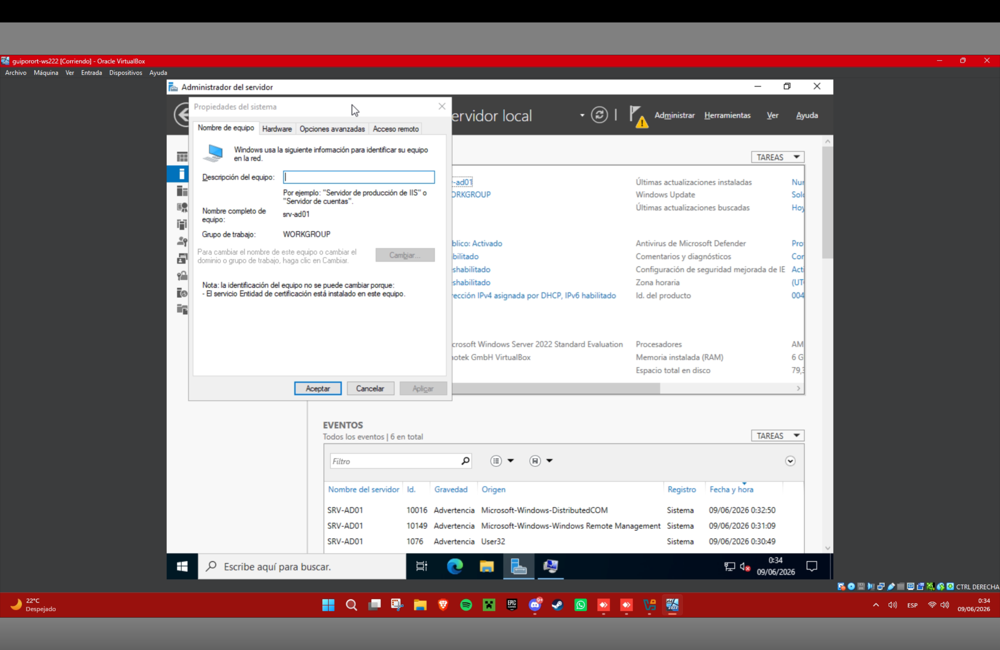
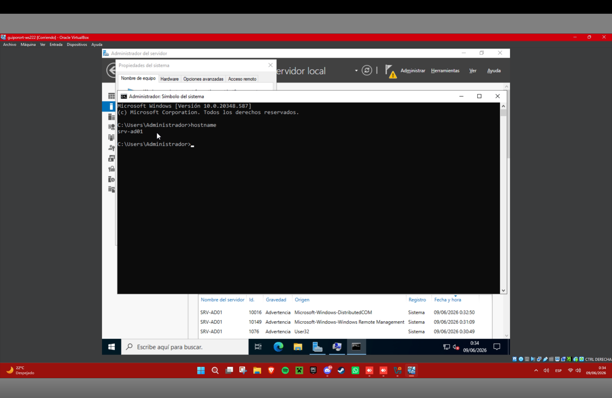

Papel de este servidor en la red
Este servidor pasará a ser el Controlador de Dominio Principal de nuestra red. Su función primordial es actuar como el cerebro y el núcleo de seguridad de toda la infraestructura. Al asignarle un nombre descriptivo y fijo como srv-ad01, nos aseguramos de que el resto de los equipos de la red corporativa (como nuestro cliente con Windows 11) puedan localizarlo fácilmente mediante consultas DNS para validar sus credenciales y configuraciones.

Documentación consultada
Manual técnico de ayuda en línea de Microsoft Learn: Rename a Windows Server computer.

2. Instalación del rol Active Directory Domain Services
Paso a paso realizado
Para este apartado, abrí el Server Manager (Administrador del Servidor). En la parte superior derecha de la interfaz, hice clic en el menú Manage (Gestionar) y luego seleccioné la opción Add Roles and Features (Agregar roles y características).

Se abrió un asistente interactivo. En la primera ventana pulsé Next. En el tipo de instalación dejé marcada por defecto la opción Role-based or feature-based installation y volví a hacer clic en Next. Posteriormente, verifiqué que en la lista de servidores estaba seleccionado mi equipo srv-ad01 con su dirección IP y pulsé Next.

Al llegar a la lista de Server Roles (Roles del Servidor), localicé la casilla Active Directory Domain Services y hice clic sobre ella para marcarla. En ese instante, saltó de forma automática una ventana emergente indicando que se necesitaban herramientas adicionales (RSAT). Hice clic en el botón Add Features para aceptar. Volví a la ventana principal del asistente, pulsé Next en el apartado de características, pasé de largo la pantalla informativa haciendo clic en Next y, finalmente, pulsé el botón Install en la pantalla de confirmación. Esperé unos minutos a que la barra azul de progreso se completara por completo.

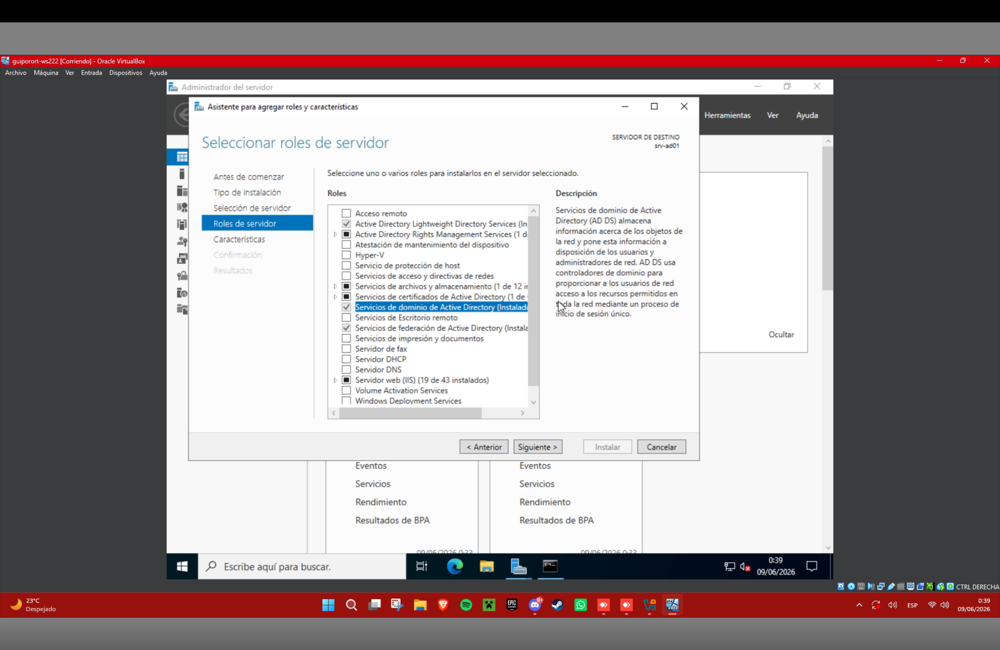

Función de Active Directory Domain Services
Este rol de servidor (AD DS) cumple la función de base de datos central de identidades de la empresa. En lugar de tener que ir ordenador por ordenador creando las cuentas de los empleados de forma local, este servicio almacena en un único punto todos los datos de los usuarios, grupos y contraseñas. Permite centralizar la autenticación (verificar la identidad de quien se conecta) y la autorización (controlar a qué carpetas o recursos tiene derecho a acceder cada uno).

Documentación consultada
Guía de despliegue oficial de Microsoft: Install Active Directory Domain Services (Level 100).

3. Promoción del servidor a controlador de dominio
Paso a paso realizado
Para este apartado, una vez que terminó de instalarse el rol, me dirigí a la parte superior del Server Manager y hice clic sobre el icono de la bandera de notificaciones que tenía un triángulo amarillo de advertencia. En el desplegable que apareció, hice clic en el enlace azul que decía Promote this server to a domain controller.

Esto abrió el asistente de configuración de despliegue. En la primera pantalla, seleccioné el botón de opción (radio button) llamado Add a new forest (Agregar un nuevo bosque). Justo debajo, en el cuadro de texto Root domain name, introduje el nombre completo de nuestro dominio: empresa.local, y hice clic en Next.

En la siguiente pestaña, dejé los niveles funcionales de Windows Server por defecto y me desplacé hacia abajo hasta los campos de contraseña del Modo de Restauración de Servicios de Directorio (DSRM). Escribí una contraseña segura en el primer cuadro, la repetí en el segundo cuadro para confirmarla y pulsé Next. Avancé haciendo clic en Next por las pestañas de Opciones DNS (ignorando la advertencia de delegación), Opciones Adicionales (donde comprobé que el nombre NetBIOS era EMPRESA) y Rutas de acceso de archivos. En la pantalla de Prerrequisitos, esperé a que apareciera el tic verde de validación correcta y hice clic en el botón Install. Al terminar el proceso, el servidor se reinició de manera totalmente automática.

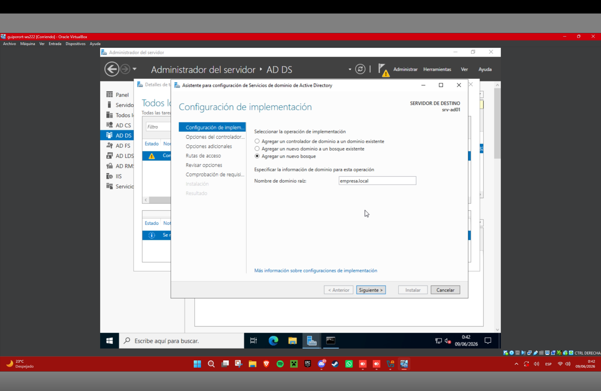
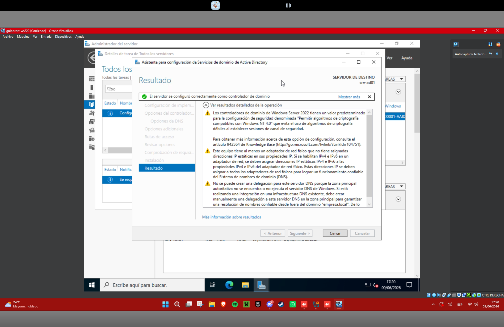

Qué significa convertir un servidor en controlador de dominio
Convertir el equipo en un Controlador de Dominio significa elevarlo al rango de "autoridad suprema de seguridad" de la red local. A partir de este momento, el servidor deja de usar la base de datos local simple (SAM) para gestionar usuarios y pasa a albergar un archivo de base de datos avanzado llamado NTDS.dit. Esto implica que el servidor ahora tiene el poder de autenticar inicios de sesión globales y aplicar directivas de obligado cumplimiento a cualquier equipo que esté unido a su red.

Documentación consultada
Microsoft Docs / Windows Server Deployment: Promoting a Windows Server to a Domain Controller.

4. Verificación del dominio
Paso a paso realizado
Para este apartado, tras el reinicio del servidor, pulsé Ctrl + Alt + Supr y observé que en la pantalla de login ahora aparecía el prefijo EMPRESA\Administrator. Introduje mi contraseña de administrador e inicié sesión.

Una vez dentro del escritorio, me fui al menú de Inicio, hice clic en Herramientas administrativas de Windows (Windows Administrative Tools) y busqué la aplicación llamada Active Directory Users and Computers (Usuarios y Equipos de Active Directory), haciendo doble clic para abrirla. En la columna de la izquierda de la ventana, hice clic en la flecha pequeña situada al lado del icono de red para desplegar todo el árbol estructural y comprobar que, efectivamente, la raíz del árbol se llamaba empresa.local, demostrando que el dominio estaba levantado y sin fallos.

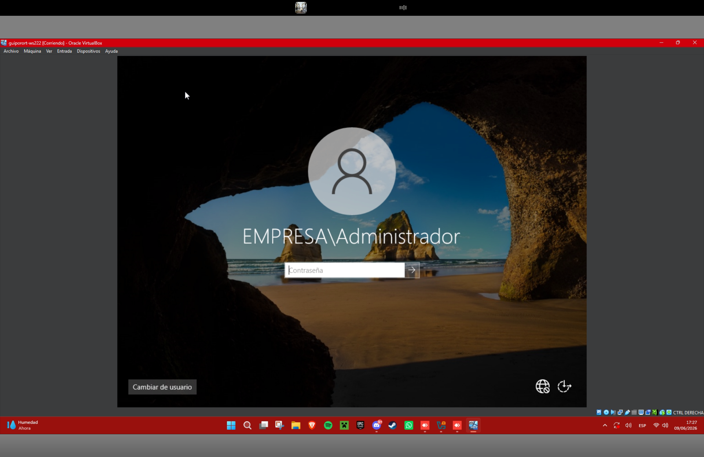
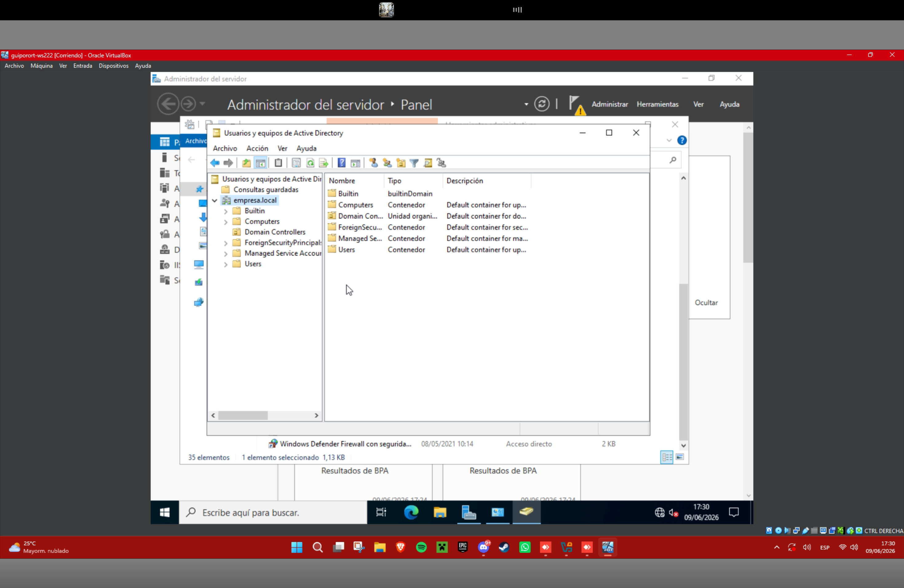

Estructura básica que aparece en el dominio
Al desplegar las carpetas de empresa.local, analicé los siguientes contenedores predeterminados:

Builtin: Contenedor que guarda los grupos de seguridad internos creados de fábrica (como el grupo de Administradores del sistema).

Computers: Carpeta vacía por defecto que servirá como almacén donde se registrarán de forma automática todos los ordenadores y puestos cliente cuando los unamos a nuestro dominio.

Domain Controllers: Unidad organizativa especial donde se guarda la cuenta de máquina de nuestro propio servidor srv-ad01, identificándolo como controlador del entorno.

Users: Contenedor por defecto donde están creadas las cuentas de administración globales (como la cuenta Administrator con la que inicié sesión) y los grupos globales del dominio.

Documentación consultada
Microsoft Learn Reference: Active Directory Default Containers and Objects.

5. Creación de usuarios de dominio
Paso a paso realizado
Para este apartado, trabajando dentro de la consola Active Directory Users and Computers, hice clic derecho directamente sobre el contenedor Users en la columna izquierda. En el menú contextual que apareció, busqué la opción New (Nuevo) y hice clic en User (Usuario).

Se abrió una pequeña ventana de configuración. En el campo First name escribí usuario1 y en el campo inferior User logon name volví a escribir usuario1. Hice clic en Next. En la siguiente pantalla de seguridad, introduje una contraseña en el campo Password y la volví a escribir en el campo de confirmación. Desmarqué la casilla que obliga a cambiar la contraseña en el próximo inicio de sesión por comodidad de la práctica y marqué la casilla Password never expires (La contraseña nunca expira). Hice clic en Next y luego en Finish.

Para crear el segundo usuario, repetí exactamente los mismos pasos: clic derecho sobre Users, seleccioné New -> User, rellené los campos con los datos de usuario2 y le asigné su contraseña correspondiente siguiendo los mismos clics.

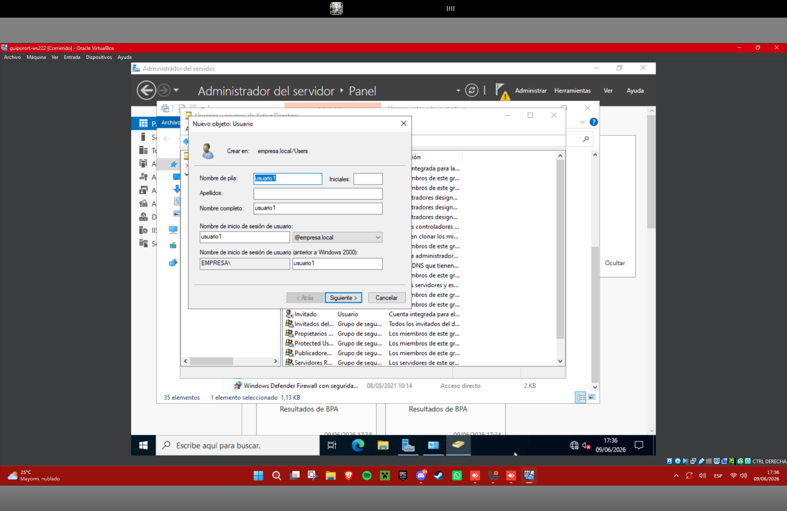
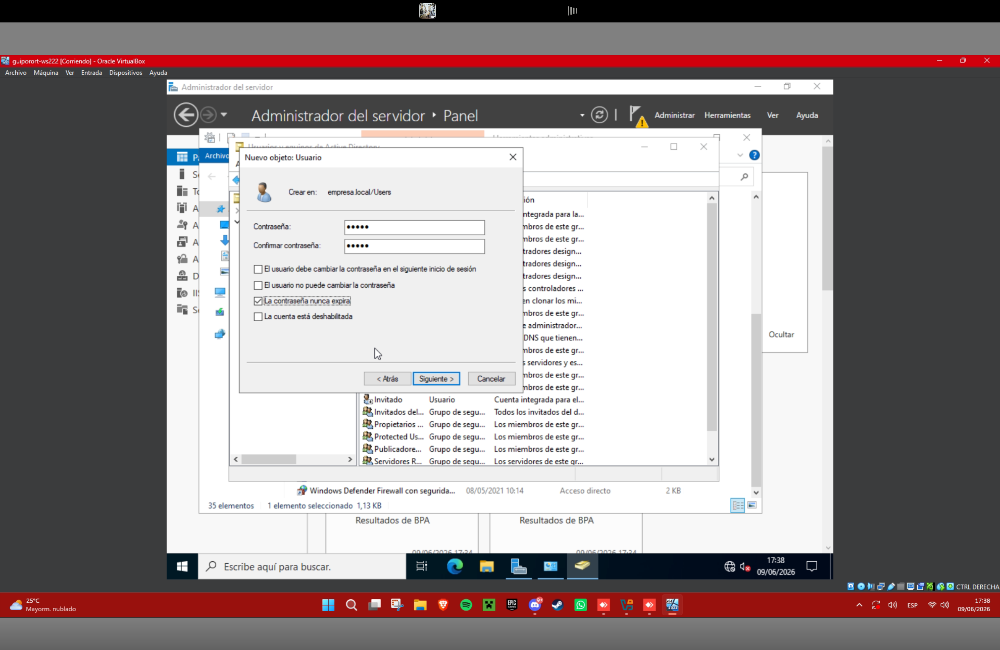
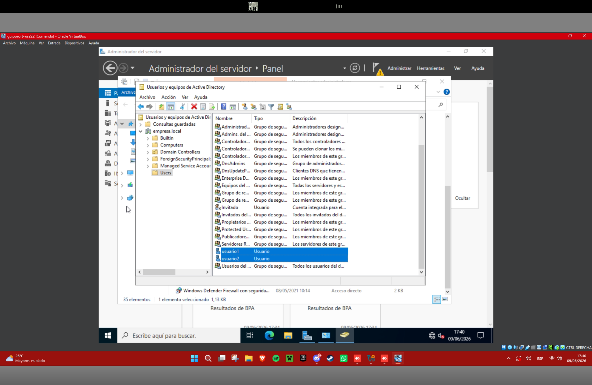

Diferencia entre usuario local y usuario de dominio
Usuario Local: Es una cuenta de usuario que se crea directamente en el disco duro de una máquina concreta. Solo sirve para entrar a esa máquina específica. Si intentas usar esas credenciales en otro ordenador de la empresa, el sistema no te reconocerá.

Usuario de Dominio: Es una identidad global que se almacena en el servidor central srv-ad01. No pertenece a ningún ordenador físico, sino que pertenece a la red corporativa. Gracias a esto, un usuario de dominio puede sentarse en cualquier ordenador cliente de la empresa que esté unido a la red, teclear su nombre y contraseña, e iniciar sesión sin problemas.

Documentación consultada
Conceptos de Cuentas de Microsoft TechNet: Understanding Local vs. Domain Accounts.

6. Preparación de la carpeta de perfiles móviles
Paso a paso realizado
Para este apartado, abrí el Explorador de Archivos en el servidor, hice clic en Este Equipo y entré dentro del disco local C:\. En un espacio en blanco, hice clic derecho, seleccioné Nuevo -> Carpeta y le puse el nombre de perfiles.

A continuación, hice clic derecho sobre la carpeta perfiles recién creada y entré en sus Propiedades. Me desplacé hasta la pestaña Sharing (Compartir) y hice clic en el botón Advanced Sharing (Uso compartido avanzado). En la pequeña ventana que se abrió, marqué la casilla Share this folder (Compartir esta carpeta) y verifiqué que en el cuadro de texto Share name pusiera exactamente perfiles.

Después, hice clic en el botón Permissions (Permisos) situado un poco más abajo. En la lista de usuarios seleccioné el grupo Everyone (Todos) y en las casillas inferiores de verificación marqué la casilla Allow (Permitir) en la fila de Full Control (Control Total). Hice clic en Aplicar, luego en Aceptar en ambas ventanas abiertos y cerré las propiedades de la carpeta.

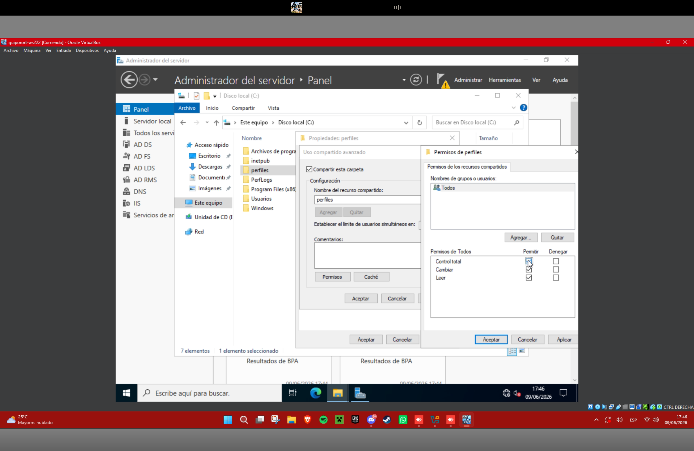

Función de esta carpeta dentro del dominio
La función de esta carpeta compartida es servir como un almacén de red centralizado. En lugar de guardar los archivos de configuración de los escritorios de los usuarios localmente en cada puesto de trabajo, esta carpeta guardará una copia maestra de los entornos de trabajo en el disco duro del servidor, sirviendo de puente para que los perfiles se vuelvan móviles.

Documentación consultada
Guía de almacenamiento en red de Windows Server: Overview of Shared Folders.

7. Configuración de perfiles móviles
Paso a paso realizado
Para este apartado, regresé a la consola de administración Active Directory Users and Computers. En el contenedor Users, busqué la cuenta de usuario1, hice clic derecho sobre ella y seleccioné la opción Properties (Propiedades).

En la ventana de propiedades del usuario, hice clic en la pestaña superior llamada Profile (Perfil). Me situé con el ratón dentro del cuadro de texto vacío del campo Profile path (Ruta del perfil) y escribí la ruta UNC de red apuntando a nuestra carpeta compartida del servidor:

\\srv-ad01\perfiles\%username%
Al escribir la variable %username% al final y hacer clic en el botón Aplicar, observé cómo el propio sistema operativo sustituía de forma automática el texto por el nombre real del usuario, transformándolo en \\srv-ad01\perfiles\usuario1. Pulsé Aceptar.

A continuación, busqué la cuenta de usuario2, hice clic derecho para entrar en sus Propiedades, navegué de nuevo a la pestaña Profile e introduje exactamente la misma ruta UNC con el comodín %username% para configurar su cuenta, pulsando Aplicar y Aceptar.

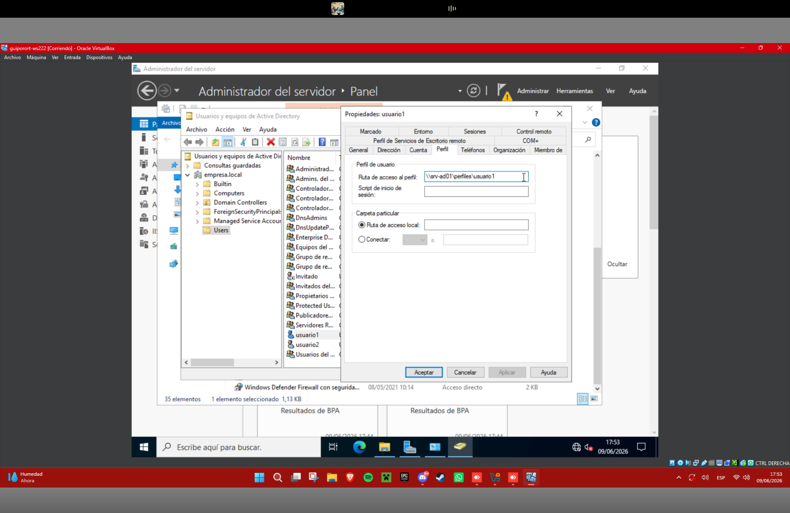

Qué es un perfil móvil y qué ventajas ofrece
Un Perfil Móvil (Roaming Profile) es una tecnología de red que hace que todo tu entorno de usuario (los iconos que tienes colocados en tu escritorio, tus documentos de la carpeta personal, el fondo de pantalla y los datos de configuración de tus aplicaciones) se guarden en un servidor central en lugar de en el disco duro local de la máquina de tu oficina.

Ventajas principales en un dominio:

Ubicuidad del puesto de trabajo: Un empleado puede iniciar sesión en cualquier equipo cliente de la compañía y verá siempre su propio escritorio personalizado tal y como lo dejó, sin importar en qué máquina física se siente.

Copias de seguridad centralizadas: Al estar los documentos de todos los empleados unificados dentro de la carpeta C:\perfiles del servidor srv-ad01, el administrador puede hacer backups de todos los datos de usuario a la vez desde un solo equipo.

Rápida sustitución de hardware: Si un ordenador cliente se rompe debido a un fallo técnico, los datos del usuario no se pierden; basta con ponerle un PC nuevo, unirlo al dominio y, cuando el usuario inicie sesión, recuperará su entorno de trabajo de forma instantánea.

Documentación consultada
Documentación de infraestructura de escritorio de Microsoft Learn: Deploy Roaming User Profiles.

8. Unión del equipo Windows 11 al dominio
Paso a paso realizado
Para este apartado, me desplacé a la máquina cliente cli01 (Windows 11). Primero abrí el panel de configuración de red de la tarjeta y verifiqué que su servidor DNS primario apuntaba manualmente a la dirección IP estática de nuestro servidor srv-ad01, ya que sin esto el cliente no sabría localizar el dominio.

A continuación, abrí el menú de Inicio, hice clic en Configuración, navegué por el menú izquierdo hasta Sistema y hice clic abajo del todo en la sección Información (About). En la pantalla que se cargó, busqué y hice clic en el enlace de texto azul llamado Configuración avanzada del sistema.

Se abrió la ventana clásica de propiedades. Hice clic en la pestaña Nombre de equipo y pulsé el botón Cambiar. En esta nueva interfaz, en la parte inferior llamada Miembro de, quité la marca de "Grupo de trabajo" y seleccioné el botón de opción Dominio. En el recuadro de texto escribí el nombre del dominio de nuestra práctica: empresa.local, y hice clic en Aceptar.

De inmediato saltó una ventana flotante de seguridad de Windows solicitando credenciales. Introduje el usuario administrador de nuestra red (EMPRESA\Administrator) junto con su contraseña y pulsé Aceptar. Tras unos segundos de carga, apareció una ventana de éxito dando la bienvenida al dominio empresa.local. Hice clic en Aceptar en los avisos emergentes y pulsé el botón Reiniciar ahora que requería el sistema.

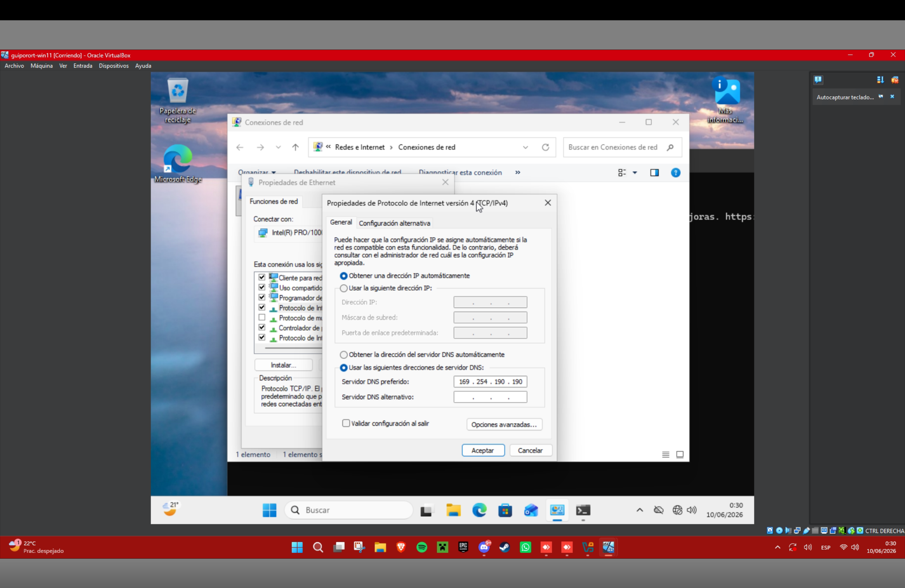
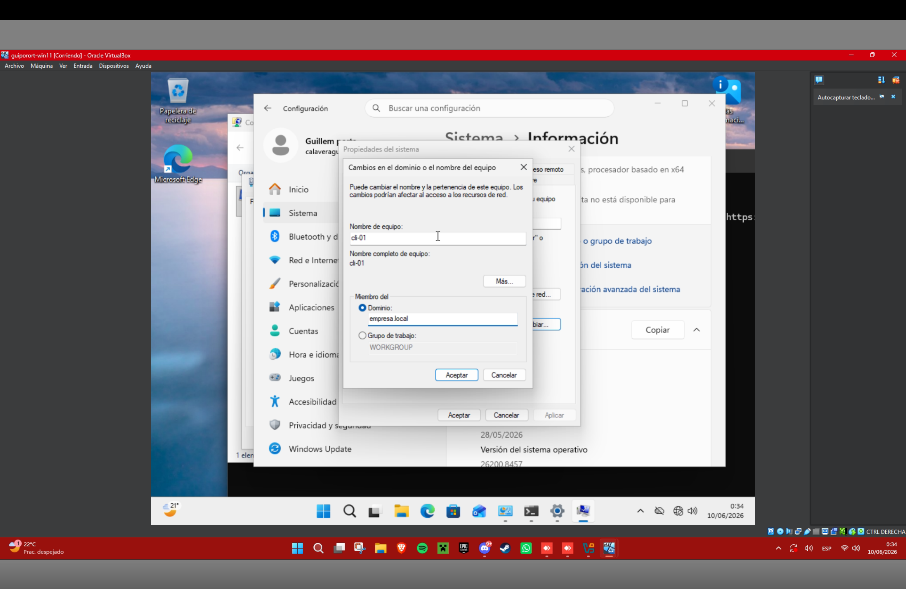

Qué significa unir un equipo a un dominio
Unir un equipo cliente a un dominio significa establecer una relación de confianza mutua permanente entre el sistema operativo local (Windows 11) y el controlador de dominio. A partir del momento de la unión, el cliente cede el control de su seguridad al servidor central. Esto significa que la máquina aceptará las identidades creadas en Active Directory para iniciar sesión en sus pantallas y se compromete a descargar y aplicar de manera forzosa las políticas y normas impuestas por el administrador desde el servidor.

Documentación consultada
Guía de conectividad de clientes Windows de Microsoft: Join a Computer to a Domain.

