

# Unidad 5
## Práctica 1

**Guillem Porta Ortuño**

**15/05/26**

---

### 1. Identificación de interfaces de red
Para este ejercicio he utilizado el comando "ip a", que muestra información sobre la tarjeta de red instalada
y de tu IP.

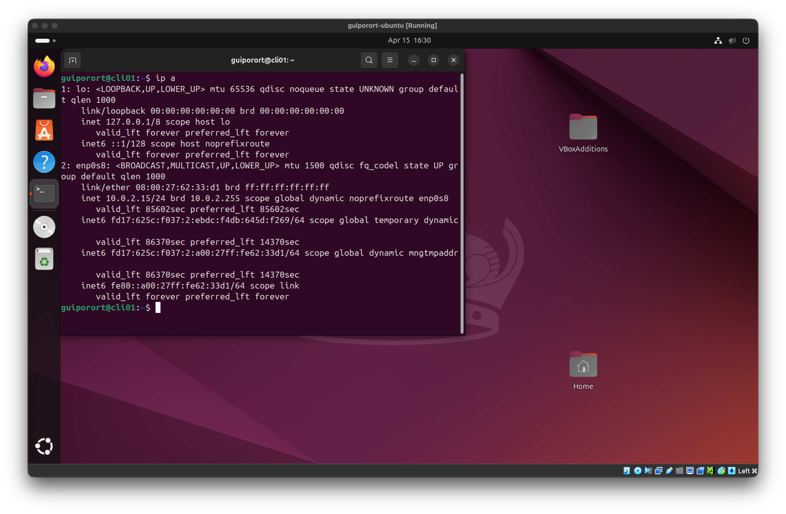
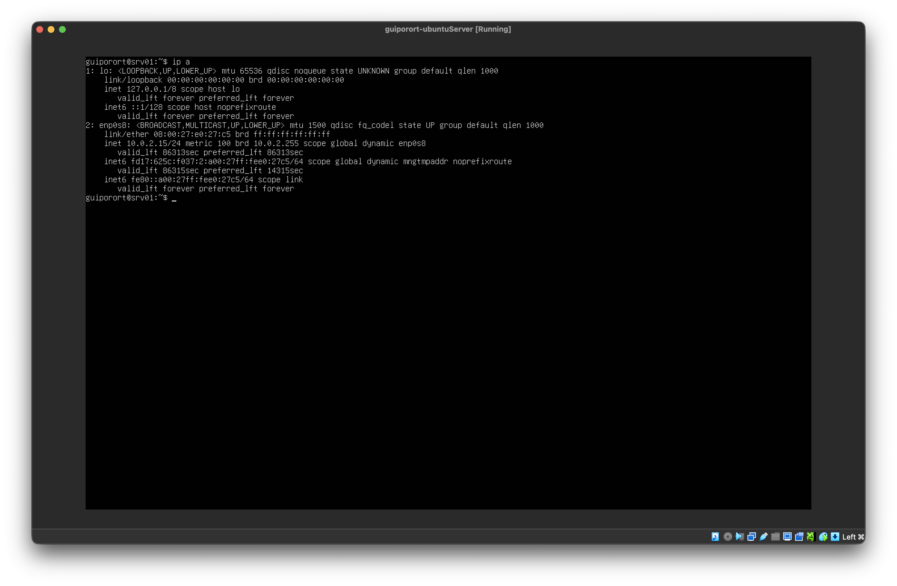

- **¿Qué interfaz de red está activa?:** enp0s8
- **¿Qué dirección IP tiene asignada actualmente?:** 10.0.2.15
- **¿Qué dirección MAC tiene la interfaz?:** 08:00:27:62:33:d1
- **¿A qué red pertenece la dirección IP?:** 10.0.2.0
  
---

### 2. Identificación de la configuración de red
En este ejercicio he ejecutado el comando "ip addr" y "ip route", el primer comando hace exactamente lo mismo que "ip a", el 
comando utilizado en el ejercicio anterior. Por otro lado el segundo comando te da información como la puerta de enlace, que es la ip
con la que sale el equipo a la red "exterior", o el rango de ip local, si quieres "hablar" con un equipo del mismo rango, no necesitas pasar
por el router ya que pertenece a la misma red.

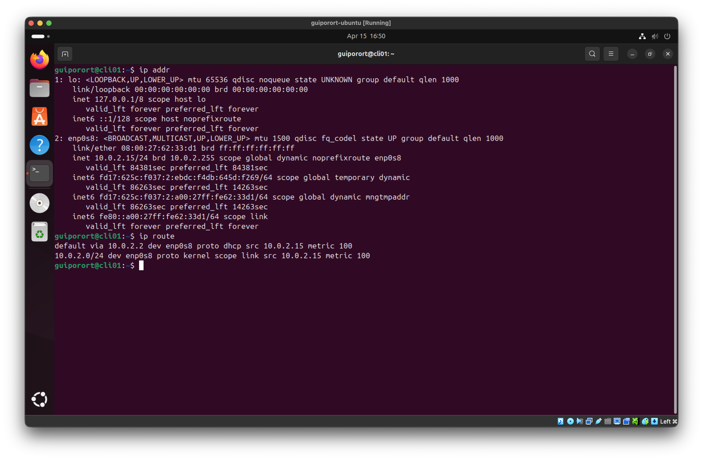

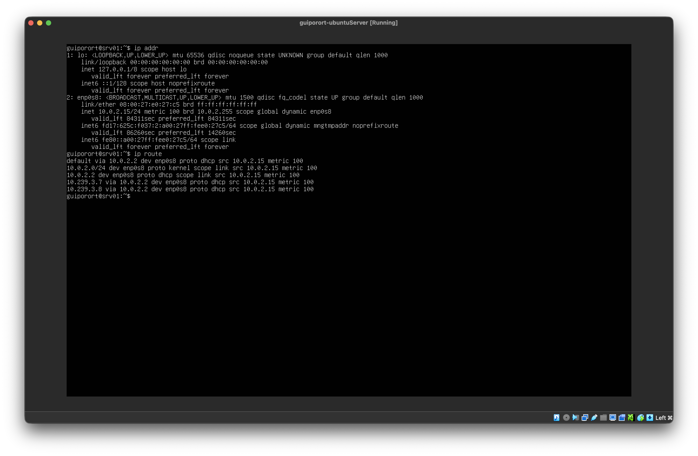

- **¿Qué red local aparece configurada?:** 10.0.2.0/24
- **¿Qué interfaz se utiliza para acceder a esa red?:** enp0s8
- **¿Existe una puerta de enlace configurada?:** 10.0.2.2

---

### 3. Configuración del nombre de host
Consulto el nombre actual con `hostname`. Como es el genérico de la instalación, procedo a cambiarlos. En el servidor ejecuto `sudo hostnamectl set-hostname srv01` y en el cliente `sudo hostnamectl set-hostname cli01`. Tras el cambio, compruebo con `hostname`.

El **hostname** es la identidad de la máquina en la red; permite que humanos y servicios identifiquen el equipo sin recordar IPs.

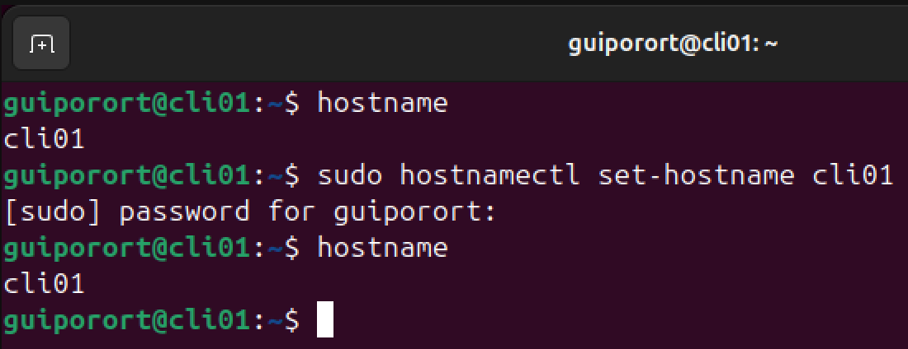
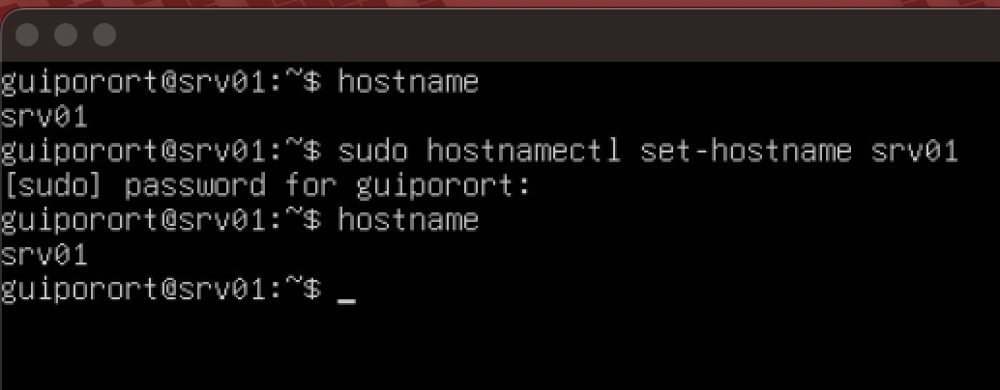

Como se puede observar, en mi caso no cambia el hostname porque ya estaba definido como se solicita.

---

### 4. Configuración de dirección IP estática
Accedo al archivo de configuración de Netplan con `sudo nano /etc/netplan/01-netcfg.yaml`. Configuro el Servidor con `192.168.50.10/24` y el Cliente con `192.168.50.20/24`. Defino `dhcp4: no` y las `addresses`.
Aplico los cambios con `sudo netplan apply` y verifico con `ip a`.
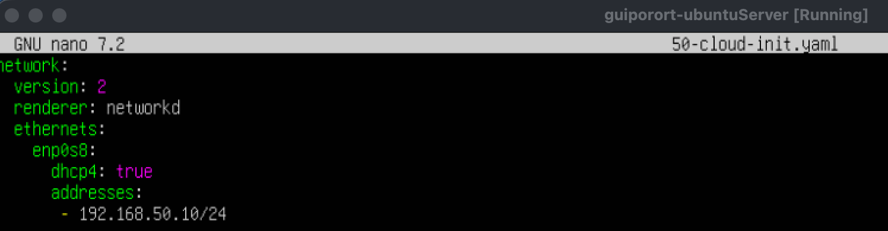
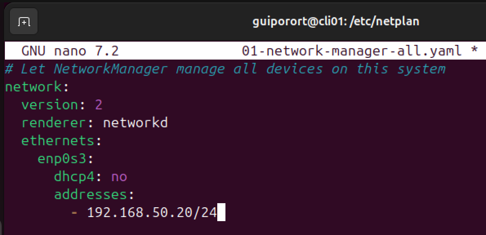

---

### 5. Verificación de conectividad entre máquinas
Llega el momento de ver si se "escuchan". Lanzo un `ping` cruzado.
- **¿Se reciben respuestas?:** Sí, el tiempo de respuesta es casi instantáneo.
- **¿Cuántos paquetes?:** Por defecto envía paquetes de forma ininterrumpida (uso `Ctrl+C` para parar).
- **Información mostrada:** El comando muestra el tiempo de ida y vuelta (RTT) y el TTL (tiempo de vida).

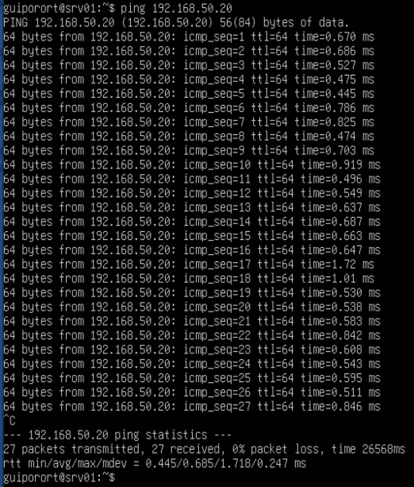
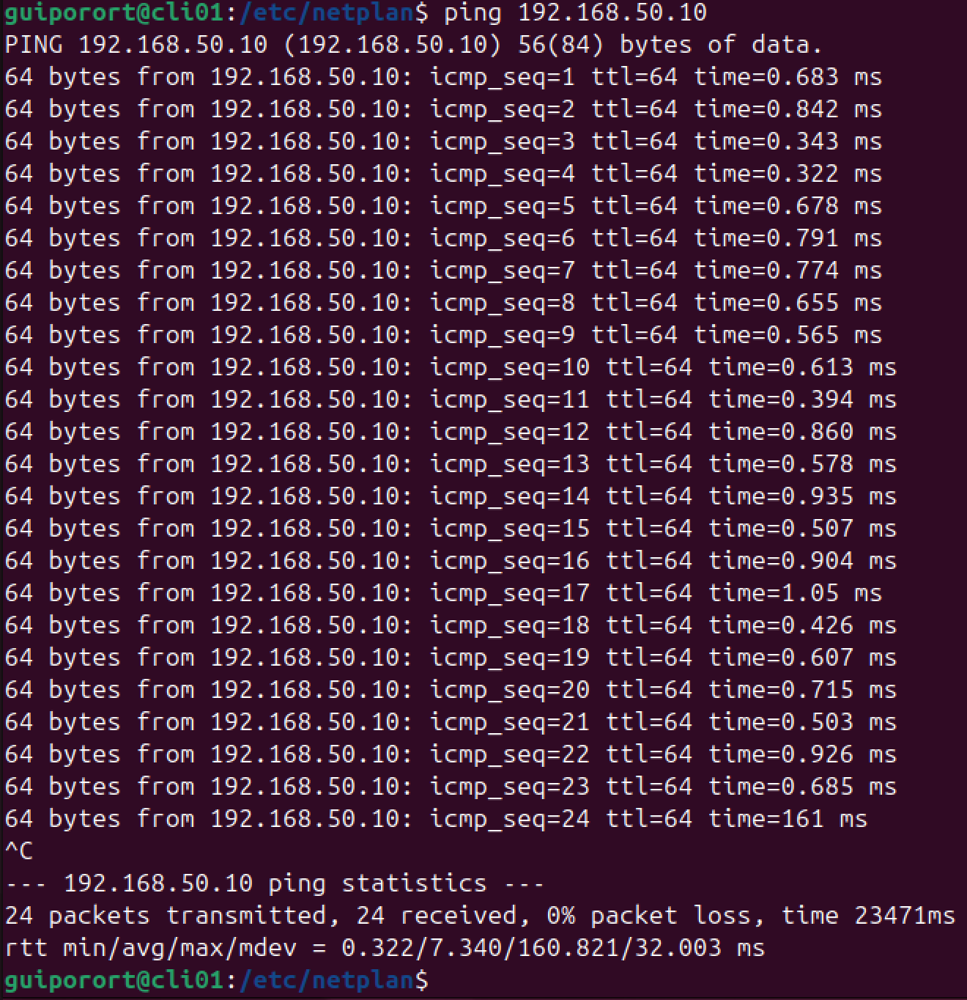
---

### 6. Configuración de resolución de nombres local
Abro `sudo nano /etc/hosts` en ambas máquinas. Añado las líneas para que `192.168.50.10` sea `srv01` y `192.168.50.20` sea `cli01`. Ahora pruebo con `ping srv01` y `ping cli01`.
Este archivo actúa como una libreta de direcciones local que el sistema consulta antes de preguntar a un DNS externo.

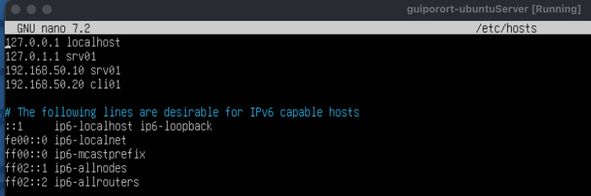
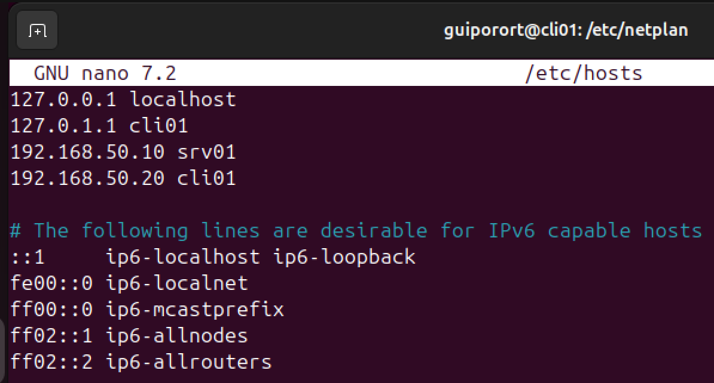
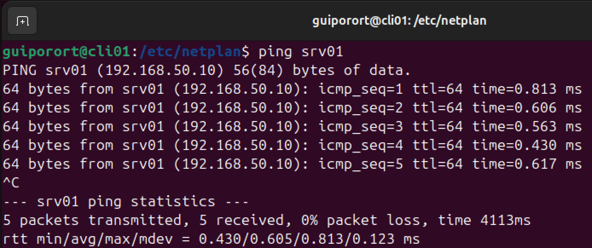
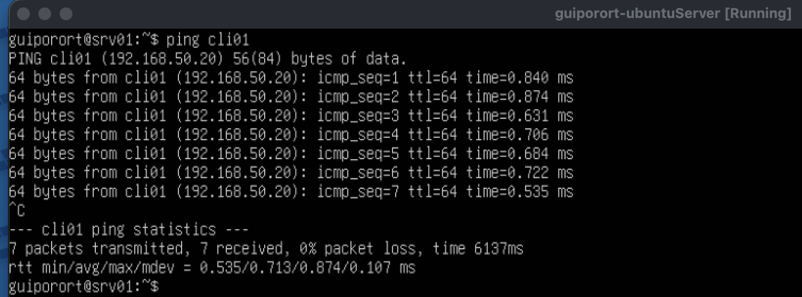

---

### 7. Análisis de rutas de red
Tras configurar la IP estática, vuelvo a ejecutar `ip route`.
- **Red en la tabla:** Ahora aparece la `192.168.50.0/24`.
- **Interfaz:** Sigue siendo `enp0s8`.
- **Columnas:** `proto kernel` indica que la ruta la creó el núcleo, `scope link` que es accesible directamente.

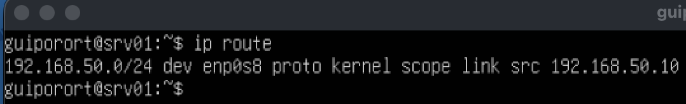
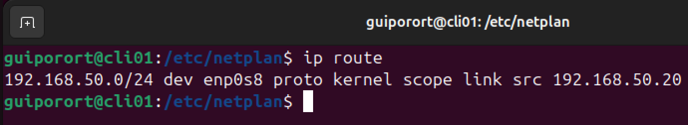

---

### 8. Identificación de puertos y servicios activos
Ejecuto `ss -tuln` para ver el estado de los "enchufes" de red.
- **Puertos abiertos:** 53 (DNS local), 631 (CUPS).
- **Protocolos:** TCP y UDP en estado LISTEN.
- **Columnas:** `Netid` (protocolo), `Local Address:Port` (donde escucha el servicio).

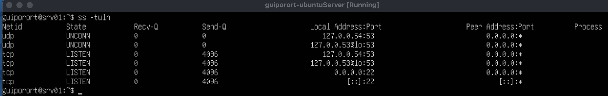
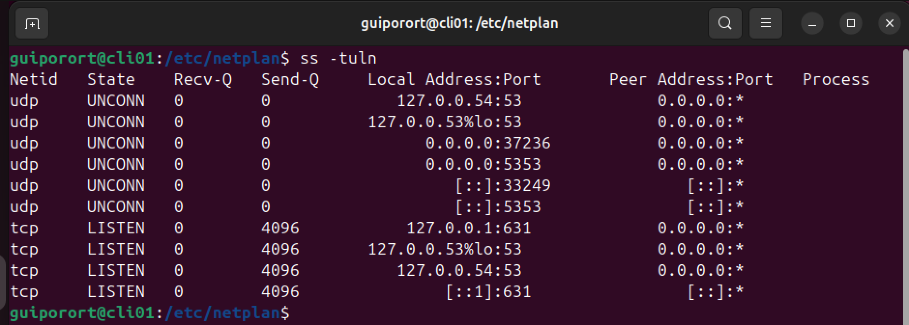

Para consultar la información sobre el comando `ss` he utilizado el comando `man ss`, que devuelve el manual del comando

---

### 9. Instalación y configuración del servicio SSH
En el servidor, actualizo con `sudo apt update` e instalo el servidor remoto con `sudo apt install openssh-server`. Verifico su estado con `sudo systemctl status ssh`. Al volver a ejecutar `ss -tuln`, veo que el puerto 22 ahora está en escucha.

SSH es un protocolo que permite el acceso seguro y cifrado a la terminal de otra máquina.

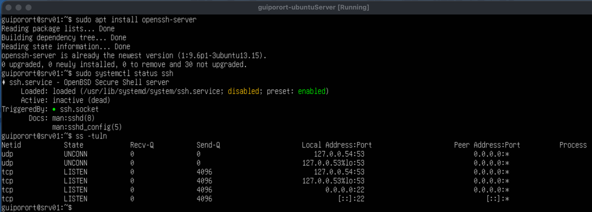

---

### 10. Acceso remoto al servidor
Desde el cliente, inicio sesión con `ssh usuario@192.168.50.10`. Una vez dentro, ejecuto `whoami` y `hostname`.
- **Usuario:** El usuario de la máquina servidor.
- **Máquina:** Aunque físicamente estoy en el cliente, los comandos se ejecutan en `srv01`.

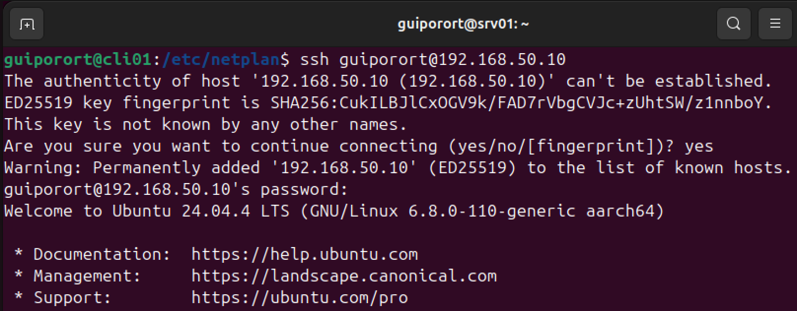
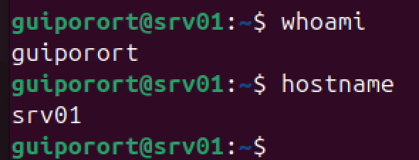

En estas capturas se muestra como, desde el cliente me he conectado al servidor, utilizando el usuario `guiporort`.
---

### 11. Análisis del estado de las interfaces
Uso `ip link` para ver el estado físico. Aparecen la `lo` y la `enp0s8`. Ambas están en estado `UP`. Este comando se centra en la capa física y de enlace, no en las IPs.

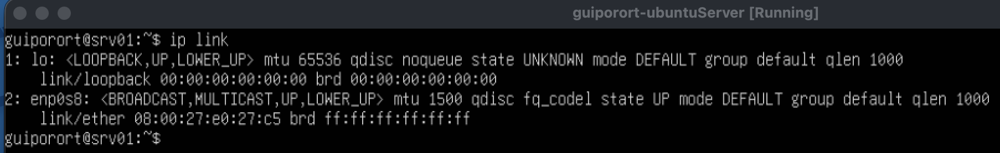
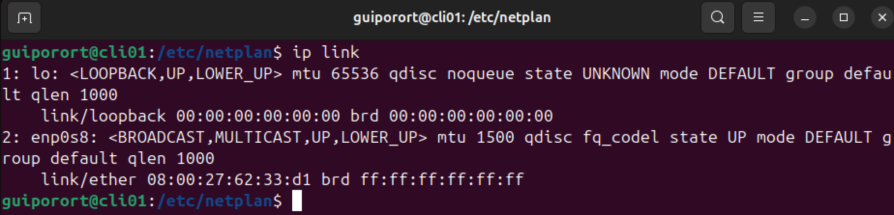

---

### 12. Consulta de la tabla ARP
Para ver cómo se asocian las IPs con las MACs, ejecuto `ip neigh` (vecinos).
Aparece la IP del otro equipo asociada a su dirección MAC física. Esto permite que los datos lleguen al hardware correcto dentro de la misma red local.

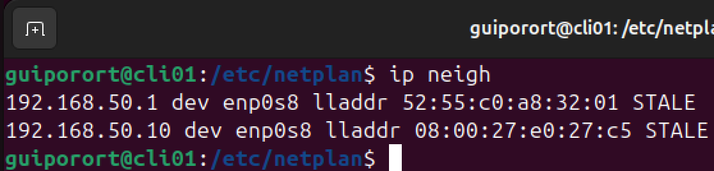

---

### 13. Transferencia de archivos entre máquinas
En el cliente, creo un archivo con `touch prueba.txt`. Lo envío al servidor con `scp prueba.txt usuario@192.168.50.10:/home/guiporort`. 
SCP utiliza el túnel seguro de SSH para copiar archivos de forma cifrada entre equipos.

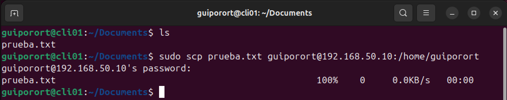
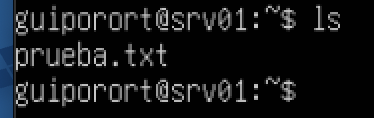

---

### 14. Gestión del servicio SSH
He intentado apagar el servicio únicamente con `sudo systemctl stop ssh`, pero seguía apareciendo el puerto 22, por lo que he investigado y en las últimas versiones de Ubuntu Server, hay que utilizar también `sudo systemctl stop ssh.socket` para apagarlo. Compruebo con `ss -tuln` y el puerto 22 ha desaparecido. Intento conectar desde el cliente y recibo "Connection refused". Reinicio con `start ssh`.

Esto demuestra que sin el proceso (demonio) escuchando en el puerto, la comunicación es imposible.

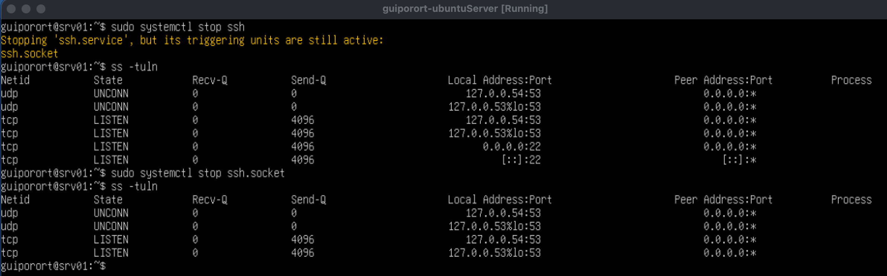
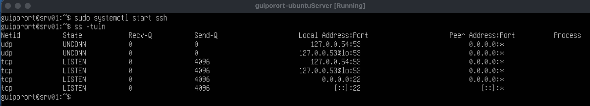
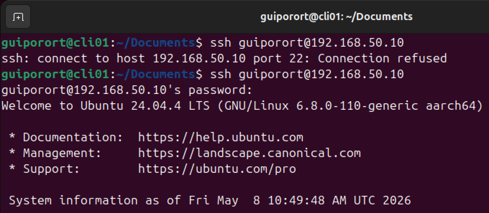

---

### 15. Reinicio y comprobación de persistencia
Lanzo `sudo reboot` en ambas. Al volver:
- La IP sigue siendo la estática (Netplan es persistente).
- El hostname sigue siendo `srv01`/`cli01`.
- El servicio SSH arranca solo porque está "enabled".

Verifico todo con `ip a`, `hostname` y `systemctl status ssh`.

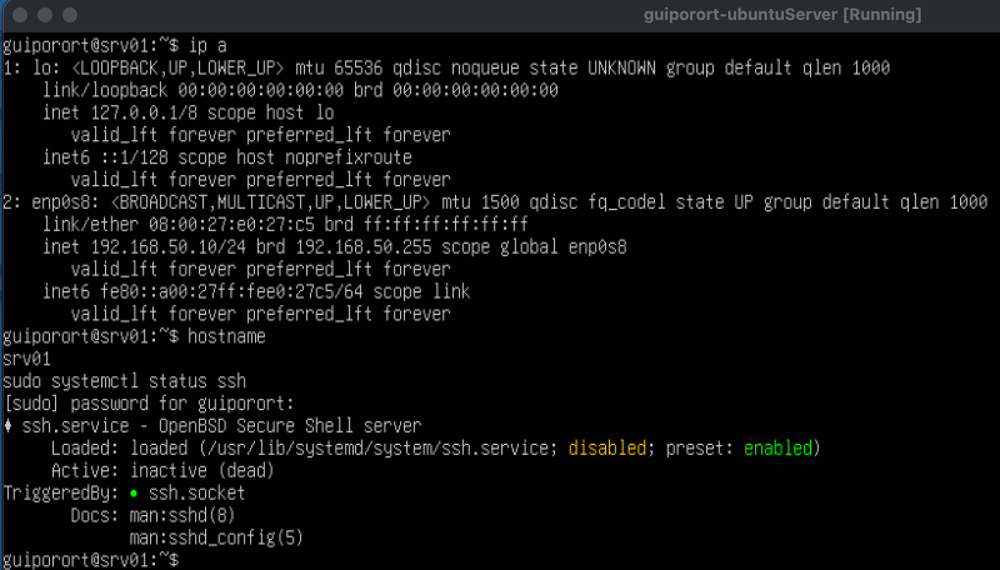
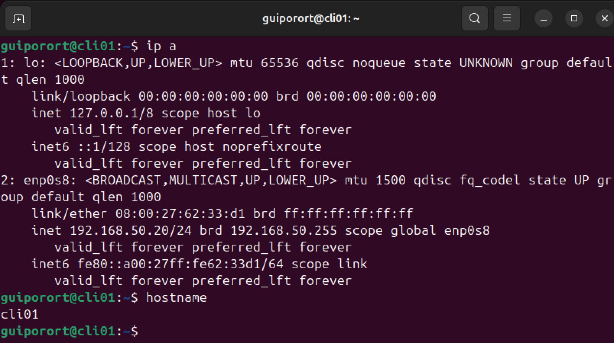
